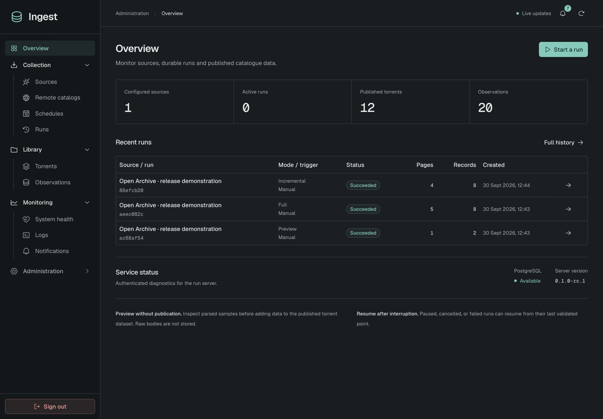
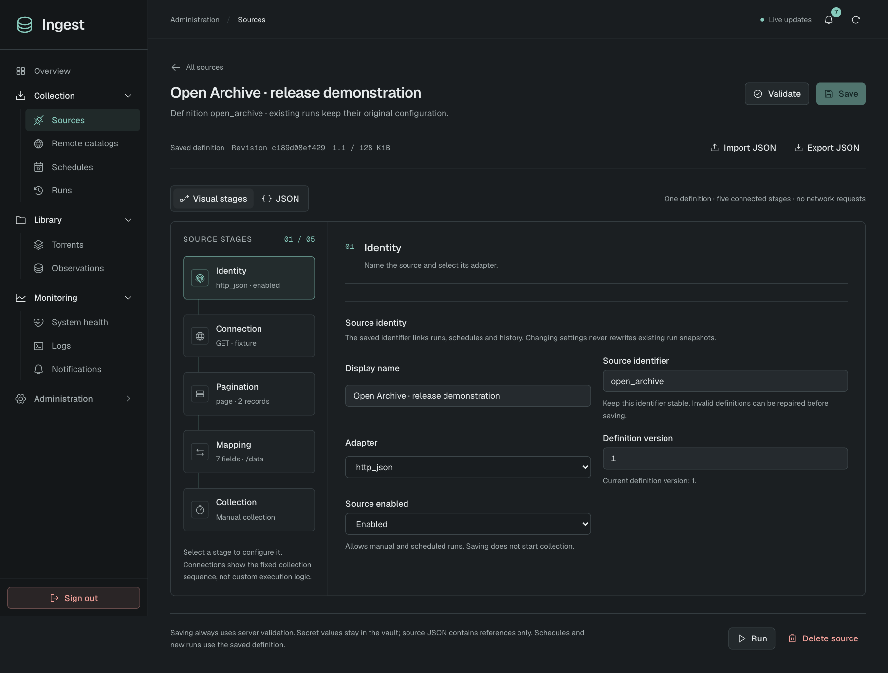

# Ingest

**Torrent metadata, with its history and provenance intact.**

A self-hosted collector for Torznab and HTTP/JSON sources, backed by PostgreSQL and an English web panel. Bring your own sources: no provider catalog is bundled.

## What it does

- **Collect reliably.** Preview, incremental, full and missing-metadata runs, with schedules and resumable checkpoints.
- **Keep provenance.** Native identities, field-level changes, compact observations and existing historical archives.
- **Find and share.** PostgreSQL search, combined filters, saved views and scoped, read-only catalogs.
- **Stay in control.** Health monitoring, webhooks, two-step authentication and verifiable encrypted backups.

**Same hash, different source? Different record.** Every `(provider_id, source_id)` stays independent, including multiple IDs within one provider. Matching info hashes never merge or hide records.





Screenshots use an isolated demonstration catalogue, not private provider data.

## Quick start

Requires Docker with Compose. Download [`compose.yaml`](compose.yaml) and [`.env.example`](.env.example) into the same directory, or use a checkout. The application runs from **`ghcr.io/moodiness/ingest`**; no Go, Node.js or source compilation is needed.

```sh
cp .env.example .env
openssl rand -hex 24
```

Set `POSTGRES_PASSWORD` in `.env` to the generated value and choose an **already published** `INGEST_VERSION`, then start:

```sh
docker compose pull
docker compose up -d
```

Once the panel is available at **http://localhost:8080**, retrieve the administrator password:

```sh
docker compose exec ingest /ingest password
```

Both published ports are loopback-only. For remote access, use an HTTPS reverse proxy and set `INGEST_PUBLIC_URL` to its exact origin. See [deployment settings](docs/SETTINGS.md) and the [security policy](SECURITY.md) before exposing the service.

`INGEST_VERSION` defaults to `latest`, which exists only after a **stable** release. For a published release candidate, explicitly set `INGEST_VERSION=0.1.0-rc.1` (or another available prerelease tag); prereleases never create or update `latest`. Pin versions without their leading `v` for controlled upgrades. Images support Linux `amd64` and `arm64` and are published by version tags, not every commit to `main`. Before any image has been published, use the [explicit local build](docs/DEVELOPMENT.md#local-docker-build).

**Existing installations:** follow the [deployment naming migration](docs/SETTINGS.md#migrating-the-former-scraper-deployment) before replacing Compose or environment files. Keep the existing database credentials, volumes and vault key.

## Connect your first source

1. Add its credentials in **Secrets**, if needed.
2. Open **Sources → Add source**, choose a protocol template or **Import JSON**, and configure the five **Visual stages**: Identity, Connection, Pagination, Mapping and Collection. Use **JSON** for advanced editing.
3. Validate, save and enable the source, then run a **Preview** to inspect a parsed sample without publishing records or storing raw bodies.
4. Start a Full to discover the selected catalogue, or an Incremental to collect newest records. Use the separate **Metadata** mode on supported native HTTP/JSON sources to fill missing configured fields across the entire existing catalogue. Enable a schedule only when ready.

Source definitions are private strict `.json` files. Validate and save never contact the source or start a run; existing runs keep their immutable snapshots. **Export JSON** downloads the current editor definition. See the [configuration guide](docs/CONFIGURATION.md) for examples, import/export and revision-conflict handling, the [complete JSON reference](docs/JSON_REFERENCE.md) for every supported option and default, or [remote catalogs](docs/SHARING.md) to synchronize another Ingest instance. Existing installations must follow [Migrating existing sources](docs/CONFIGURATION.md#migrating-existing-sources) offline before activating legacy definitions.

## Documentation

| Guide                                  | What you will find                                                                |
| -------------------------------------- | --------------------------------------------------------------------------------- |
| [Configuration](docs/CONFIGURATION.md) | Source JSON, visual stages, migration, protocols, authentication, pagination and schedules. |
| [JSON reference](docs/JSON_REFERENCE.md) | Every source and separate standalone SDK JSON field, defaults, constraints, examples and Compose controls. |
| [Settings](docs/SETTINGS.md)           | Docker, environment variables, storage, remote access and administrator security. |
| [Operations](docs/OPERATIONS.md)       | Run behavior, search, history, logs, webhooks and health monitoring.              |
| [Backups](docs/BACKUPS.md)             | Encrypted archives, verification and safe recovery into a new destination.        |
| [Sharing](docs/SHARING.md)             | Read-only access, quotas, remote synchronization and transport boundaries.        |
| [Development](docs/DEVELOPMENT.md)     | Native setup, hot reload, CLI usage, checks and the standalone Torznab SDK.       |

New response bodies, original record bytes and duplicate non-Preview field snapshots are not stored. Published native catalogue data, observations, resume state and publication history remain. Historical raw archives are retained and still downloadable; this change does not delete old data or reclaim its existing disk usage. Keep the backup recovery identity outside the server and encrypted copies on independent storage.

## Development

Requires Go **1.26.8+**, Node.js **22.19+** and PostgreSQL for running the service.

```sh
make build
make check
```

The production binary embeds the frontend; Node.js is not needed at runtime. See [Development](docs/DEVELOPMENT.md) for setup, PostgreSQL integration checks and the non-publishing release checklist.

## License and security

Project code is [MIT licensed](LICENSE). Third-party dependencies retain their own licenses.

For vulnerability reports and deployment boundaries, read [SECURITY.md](SECURITY.md).
